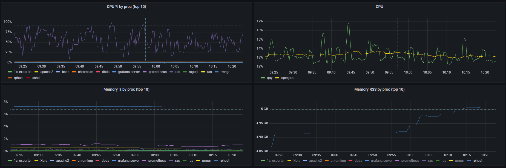
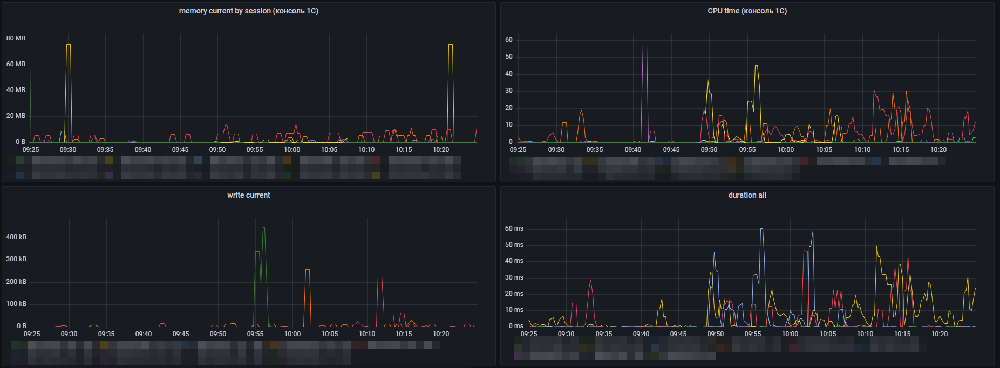

# Prometheus 1C Exporter

Многофункциональный экспортер метрик 1С для Prometheus с расширенными возможностями управления сбором данных.

## 🔍 Возможности

- Сбор ключевых метрик 1С через утилиту `rac`:
  - Клиентские лицензии
  - Производительность серверов приложений
  - Активные соединения и сеансы
  - Ресурсы процессов (память, CPU)
  - Состояние дисковых операций (IOPS, latency)
  - Статус регламентных заданий
  - И другие [показатели производительности](#-метрики)

- Гибкое управление сбором метрик:
  - Выборочная приостановка сбора
  - Автоматическое возобновление
  - Раздельные эндпоинты для разных типов метрик

- Готовые примеры визуализации для Grafana
- Поддержка работы в качестве службы (Windows/Linux)





## 📦 Установка

### Предварительные требования
- Go 1.19+ (для сборки из исходников)
- Доступ к утилите `rac`
- Prometheus 2.0+

### Способы установки:
1. **Готовые бинарники**:  
   [Скачать последний релиз](https://github.com/LazarenkoA/prometheus_1C_exporter/releases)

2. **Сборка из исходников**:
   ```bash
   git clone https://github.com/LazarenkoA/prometheus_1C_exporter
   cd prometheus_1C_exporter
   go build -o "1C_exporter"
   ```

## 🚀 Запуск

**Linux:**
```bash
./1C_exporter -port=9095 --settings=/path/to/settings.yaml
```

**Windows:**
```cmd
1C_exporter.exe -port=9095 --settings=/path/to/settings.yaml
```

Пример настроек [examples_settings.yaml](examples_settings.yaml)

## ⚙️ Конфигурация Prometheus

Добавьте в `prometheus.yml`:

```yaml
scrape_configs:
  - job_name: '1c_metrics'
    scrape_interval: 30s
    metrics_path: '/metrics'
    static_configs:
      - targets: ['1c-server1:9091', '1c-server2:9091']
```

Опционально: раздельные задания для разных типов метрик

```yaml
scrape_configs:
  - job_name: '1c_os_metrics'
    scrape_interval: 10s
    metrics_path: '/metrics_os'
    static_configs:
      - targets: ['1c-server1:9091']

  - job_name: '1c_rac_metrics'
    scrape_interval: 30s
    metrics_path: '/metrics_rac'
    static_configs:
      - targets: ['1c-server1:9091']
```

## 🛠 Методы HTTP-сервиса

| Метод | URL-формат | Параметры | Описание |
|-------|------------|-----------|----------|
| GET | `/` | – | Информационная страница со списком доступных эндпоинтов |
| GET | `/metrics` | – | Основные метрики Prometheus (композиционные) |
| GET | `/metrics_os` | – | Метрики операционной системы (CPU, память, диски) |
| GET | `/metrics_rac` | – | Метрики RAC (лицензии, соединения, сеансы) |
| GET | `/metrics_internal` | – | Метрики работы экспортера |
| GET | `/Pause` | `metricNames`<br>`offsetMin` (опционально) | Приостанавливает сбор указанных метрик на заданное время (в минутах) |
| GET | `/Continue` | `metricNames` | Возобновляет сбор указанных метрик |
| GET | `/log` | `mode`, `n`, `from` | Читает содержимое лога: <br>`mode=first` – первые `n` строк,<br>`mode=last` – последние `n` строк,<br>`mode=range` – строки с `from` по `from+n-1` |
| GET | `/config/get` | – | Возвращает текущий конфигурационный файл `settings.yml` |
| POST | `/config/set` | `file` (multipart/form-data) | Загружает новый конфигурационный файл (`settings.yml`) и применяет его без перезапуска |
| GET | `/debug/pprof/*` | – | Стандартные эндпоинты для профилирования Go |
| POST | `/shutdown_emulate` | `exit_code` (опционально) | Аварийно завершает процесс с указанным кодом выхода |
| GET | `/secrets` | – | Информация о загруженных секретах (наличие, список баз, время обновления) |
| GET | `/secrets/pub_key` | – | Возвращает публичный ключ RSA в формате PEM |
| POST | `/secrets/set` | бинарные данные | Принимает зашифрованные секреты (JSON-пакет), расшифровывает и сохраняет их |
| POST | `/secrets/encrypt` | JSON с открытыми секретами | Шифрует открытые секреты публичным ключом и возвращает JSON-пакет для отправки на `/secrets/set` |

### Примеры использования

#### Через браузер (GET-запросы)

- **Главная страница** – отображает информацию о сервисе и список доступных эндпоинтов в формате JSON.  
  Откройте в браузере: `http://localhost:9091/`

- **Метрики Prometheus**  
  - Общие метрики: `http://localhost:9091/metrics`  
  - Метрики операционной системы: `http://localhost:9091/metrics_os`  
  - Метрики RAC: `http://localhost:9091/metrics_rac`  
  В браузере отобразится текстовый вывод в формате Prometheus.

- **Публичный ключ** – для получения PEM-ключа:  
  `http://localhost:9091/secrets/pub_key`  
  Браузер скачает файл публичного ключа.

- **Конфигурация** – получить текущий файл `settings.yml`:  
  `http://localhost:9091/config/get`

- **Информация о секретах** – для проверки загруженных секретов:  
  `http://localhost:9091/secrets`  
  Вернется JSON с полями `has_secrets`, `has_default`, `has_ras`, `bases`, `last_updated`.

- **Чтение логов** – пример для просмотра последних 50 строк лога:  
  `http://localhost:9091/log?mode=last&n=50`  
  (можно менять параметры прямо в адресной строке)

- **Профилирование Go** – стандартные эндпоинты pprof:  
  `http://localhost:9091/debug/pprof/` – список профилей  
  `http://localhost:9091/debug/pprof/heap` – профиль памяти  
  и т.д. (доступны все стандартные pprof-маршруты)

- **Приостановка и возобновление сбора метрик** (параметры передаются в строке запроса):  
  Приостановить сбор метрик `processes,connections` на 5 минут:  
  `http://localhost:9091/Pause?metricNames=processes,connections&offsetMin=5`  
  Возобновить сбор метрик `disk_metrics`:  
  `http://localhost:9091/Continue?metricNames=disk_metrics`

#### Через cURL

- **Получение публичного ключа**
  ```bash
  curl http://localhost:9091/secrets/pub_key > exporter.pub
  ```

- **Шифрование секретов с помощью эндпоинта `/secrets/encrypt`**
  ```bash
  curl -X POST http://localhost:9091/secrets/encrypt -H "Content-Type: application/json" -d @secrets.json --output secrets.json.enc
  ```

- **Отправка зашифрованных секретов**
  ```bash
  curl -X POST http://localhost:9091/secrets/set --data-binary @secrets.json.enc
  ```

- **Загрузка нового конфигурационного файла**
  ```bash
  curl -X POST http://localhost:9091/config/set -F "file=@settings.yml"
  ```

- **Получение текущего конфигурационного файла**
  ```bash
  curl http://localhost:9091/config/get --output settings.yml
  ```

- **Эмуляция аварийного завершения**
  ```bash
  curl -X POST "http://localhost:9091/shutdown_emulate?exit_code=0"
  ```

- **Чтение логов** (последние 50 строк)
  ```bash
  curl "http://localhost:9091/log?mode=last&n=50"
  ```

- **Приостановка сбора метрик**
  ```bash
  curl "http://localhost:9091/Pause?metricNames=processes,connections&offsetMin=5"
  ```

- **Возобновление сбора метрик**
  ```bash
  curl "http://localhost:9091/Continue?metricNames=disk_metrics"
  ```

#### Шифрование секретов с помощью bash-скрипта (локально, без передачи открытых данных)

Для шифрования секретов без передачи их по сети, можно использовать bash-скрипт. Это требует наличия Git Bash (входит в состав Git for Windows) или соответствующей утилиты Linux-окружения.

**Скрипт `encrypt.sh`** (сохраните в папку с `exporter.pub` и `secrets.json`):

```bash
#!/bin/bash
set -e

INPUT="${1:-secrets.json}"
OUTPUT="${2:-secrets.json.enc}"

command -v openssl >/dev/null 2>&1 || { echo "ERROR: openssl not found"; exit 1; }
command -v base64 >/dev/null 2>&1 || { echo "ERROR: base64 not found"; exit 1; }
command -v xxd >/dev/null 2>&1 || { echo "ERROR: xxd not found. Install it (e.g., apt install xxd)."; exit 1; }

if [ ! -f exporter.pub ]; then
    echo "ERROR: exporter.pub not found"
    exit 1
fi

if [ ! -f "$INPUT" ]; then
    echo "ERROR: input file '$INPUT' not found"
    exit 1
fi

echo "Generating AES key and IV..."
openssl rand -out aes_key.bin 32
openssl rand -out iv.bin 16

AES_KEY_HEX=$(xxd -p -c 256 aes_key.bin)
IV_HEX=$(xxd -p -c 256 iv.bin)

echo "Encrypting data with AES-256-CBC..."
openssl enc -aes-256-cbc -K "$AES_KEY_HEX" -iv "$IV_HEX" -in "$INPUT" -out encrypted_data.bin

echo "Encrypting AES key with RSA..."
openssl pkeyutl -encrypt -pubin -inkey exporter.pub -in aes_key.bin -out encrypted_key.bin -pkeyopt rsa_padding_mode:oaep -pkeyopt rsa_oaep_md:sha256

echo "Encoding components to base64..."
ENCRYPTED_KEY_B64=$(base64 -w0 encrypted_key.bin)
IV_B64=$(base64 -w0 iv.bin)
DATA_B64=$(base64 -w0 encrypted_data.bin)

cat > "$OUTPUT" <<EOF
{
  "encrypted_key": "$ENCRYPTED_KEY_B64",
  "iv": "$IV_B64",
  "data": "$DATA_B64"
}
EOF

rm -f aes_key.bin iv.bin encrypted_key.bin encrypted_data.bin

echo "Done. Encrypted file: $OUTPUT"
```

**Запуск в Windows (Git Bash):**

1. Откройте Git Bash.
2. Перейдите в папку с файлами: `cd /c/путь_к_папке`
3. Запустите: `./encrypt.sh secrets.json`
4. Полученный файл `secrets.json.enc` отправьте на экспортер командой:
   ``` bash
   curl -X POST http://localhost:9091/secrets/set --data-binary @secrets.json.enc
   ```

**Запуск в Linux**

Выполняется аналогично. Перед этим необходимо сделать скрипт исполняемым: `chmod +x encrypt.sh`

## 📊 Метрики

### Основные категории

| Категория      | Метрики                       | Эндпоинт |
|----------------|-------------------------------|----------|
| Системные      | CPU, память, диски             | `/metrics_os` |
| RAC-метрики    | Лицензии, соединения, сеансы   | `/metrics_rac` |
| Композиционные | Все метрики                    | `/metrics` |

### Детализация метрик

| Метрика | Описание | Тип данных |
|---------|----------|------------|
| `available_performance` | Доступная производительность хоста | SummaryVec |
| `sessions_data` | Показатели сессий из кластера 1С | SummaryVec |
| `session` | Сессии 1С | SummaryVec и/или GaugeVec |
| `connect` | Соединения 1С | SummaryVec |
| `client_lic` | Клиентские лицензии 1С | SummaryVec |
| `shedule_job` | Состояние галки "блокировка регламентных заданий", если галка установлена значение будет 1 иначе 0 или метрика будет отсутствовать | Gauge |
| `cpu` | Метрики CPU (общий процент загрузки процессора) | SummaryVec |
| `processes` | Метрики CPU/памяти в разрезе процессов | SummaryVec |
| `disk` | Показатели дисков | SummaryVec |

## 📈 Примеры запросов PromQL

- Клиентские лицензии:
  ```
  sum by (licSRV) (client_lic{quantile="0.99", licSRV=~"(?i).+sys.+"})
  ```

- Средняя загрузка CPU:
  ```
  avg_over_time(cpu{quantile="0.99"} [1m])
  ```

- Загрузка CPU в разрезе процессов:
  ```
  topk(10, sum(avg_over_time(processes{quantile="0.99", metrics="cpu"}[1m])) by (procName) )
  ```

- Загрузка ОЗУ в разрезе процессов:
  ```
  topk(10, sum(avg_over_time(processes{quantile="0.99", metrics="memoryRSS"}[1m])) by (procName) )
  ```

- Доступная производительность 1С:
  ```
  avg_over_time(available_performance{quantile="0.99"}[10m])
  ```

- Количество сеансов в 1С:
  ```
  session{quantile="0.99"}
  ```

- CPU time (консоль 1С)
  ```
  rate(sessions_data{quantile="0.99", datatype="cputimetotal"}[5m])
  ```

## ⚠️ Локализация ошибок

При возникновении проблем проверьте:
- Доступность RAC-утилиты
- Права на чтение конфигурационного файла
- Открытые порты в firewall
- Логи приложения (режим отладки через установку уровня логирования `LogLevel: 5` в конфигурационном файле)

## 🔄 Интеграция с self-hosted GitLab

Для централизованного управления конфигурацией и секретами экспортер может взаимодействовать с GitLab CI/CD. Это позволяет автоматически обновлять настройки и безопасно доставлять учетные данные для баз 1С.

### 1. Общие настройки

Для работы экспортера в режиме `internal` (внутреннее хранение секретов) и для самообновления используются настройки GitLab. Теперь для всех операций (запуск pipeline, чтение релизов) применяется единый **Personal Access Token** с правами `api`.

### Конфигурация в `settings.yml`

```yaml
GitLab:
  GitLabHome: "https://gitlab.example.com"   # базовый URL GitLab (обязательно)
  ProjectID: 123456                         # ID проекта, где хранятся конфигурации и секреты (обязательно)
  Branch: "main"                            # ветка, в которой лежат конфигурационные файлы (обязательно)
  SecretsFile: "secrets.json.enc"           # имя файла с зашифрованными секретами (по умолчанию)
  AccessToken: "glpat-xxxxxxxxxxxxxxxx"     # Personal Access Token с правами api (обязательно)
  # ReleasesProjectID: 123456               # опционально: ID проекта для самообновления (если не задан, используется ProjectID)
```

| Поле | Обязательное | Описание |
|------|--------------|----------|
| `GitLabHome` | ✅ | Базовый URL GitLab (например, `https://gitlab.example.com`). |
| `ProjectID` | ✅ | Числовой ID проекта GitLab, где хранятся конфигурационные файлы и секреты. |
| `Branch` | ✅ | Ветка репозитория, из которой экспортер будет получать конфигурацию и секреты. |
| `SecretsFile` | ❌ | Имя файла с зашифрованными секретами (по умолчанию `secrets.json.enc`). |
| `AccessToken` | ✅ | Personal Access Token с правами `api`. Используется для запуска pipeline (через заголовок `PRIVATE-TOKEN`) и для доступа к релизам при самообновлении. |
| `ReleasesProjectID` | ❌ | ID проекта GitLab, где хранятся релизы экспортера для самообновления. Если не указан, используется `ProjectID`. |

### Примечания

- Токен должен быть создан в GitLab с правами `api`. Он будет использоваться как для инициации pipeline (чтобы экспортер мог запросить секреты), так и для скачивания новых версий при самообновлении.
- Если проект с релизами отличается от проекта с конфигурациями, укажите `ReleasesProjectID`. В противном случае оба процесса будут работать с проектом, указанным в `ProjectID`.

Перед настройкой автоматизации выполните следующие шаги:

1. **Создайте отдельный GitLab-проект**, в котором будут храниться конфигурационные файлы для каждого экземпляра экспортера.
2. **Для каждого экземпляра создайте отдельную ветку** (например, `web`, `rls`, `trade`). В каждой ветке будут находиться:
   * `settings.yml` – основной конфигурационный файл.
   * `secrets.json.enc` – зашифрованные секреты (опционально).
   * `exporter-vars.yml` – файл с переменными для CI/CD (обязателен).
3. **Содержимое `exporter-vars.yml`**:
   ```yaml
   variables:
     SERVER_URL: "http://server-web:9091"   # базовый URL экспортера (без пути)
     # FILE_TO_UPLOAD: "settings.yml"       # опционально: имя файла конфигурации, по умолчанию settings.yml
     # SECRETS_FILE: "secrets.json.enc"     # опционально: имя файла секретов, по умолчанию secrets.json.enc
   ```

4. **В каждой ветке** создайте файл `main-pipeline.yml` с общим кодом pipeline (см. ниже). Поскольку pipeline берется из текущей ветки, при необходимости можно иметь разные версии, но рекомендуется синхронизировать их через merge из `main`.
5. **В настройках CI/CD проекта** (Settings → CI/CD → General pipelines) в поле **CI/CD configuration file** (Файл конфигурации CI/CD) укажите имя файла pipeline:  
   `main-pipeline.yml`  
   (без указания ветки, так как файл должен присутствовать во всех ветках).

**Содержание `main-pipeline.yml`:**

```yaml
include:
  - local: 'exporter-vars.yml'

stages:
  - upload

default:
  image: alpine/curl:8.17.0

upload_file:
  stage: upload
  rules:
    - if: $CI_PIPELINE_SOURCE == "push" && $CI_COMMIT_BRANCH != "main"
      changes:
        - settings.yml
      when: always
    - when: never
  script:
    - FILE_TO_UPLOAD=${FILE_TO_UPLOAD:-settings.yml}
    - echo "Uploading $FILE_TO_UPLOAD to $SERVER_URL"
    - curl -X POST -F "file=@$FILE_TO_UPLOAD" "$SERVER_URL/config/set" --fail

send_secrets:
  stage: upload
  rules:
    - if: $CI_PIPELINE_SOURCE == "trigger"
    - changes:
        - secrets.json.enc
      when: always
  script:
    - SECRETS_FILE=${SECRETS_FILE:-secrets.json.enc}
    - if [ ! -f "$SECRETS_FILE" ]; then echo "Secrets file not found"; exit 1; fi
    - curl -X POST "$SERVER_URL/secrets/set" --data-binary "@$SECRETS_FILE" --fail
    - echo "Secrets delivered"
```

### 2. Обновление конфигурационного файла

При каждом изменении `settings.yml` (или файла, указанного в `FILE_TO_UPLOAD`) в любой ветке (кроме `main`) автоматически запускается job `upload_file`, который отправляет новый конфиг на экспортер через метод `/config/set`. Экспортер применяет новые настройки без перезапуска.

Для корректной работы убедитесь, что:
* В файле `exporter-vars.yml` ветки определена переменная `SERVER_URL`.
* Ветка содержит актуальный `main-pipeline.yml`.

### 3. Безопасное хранение и доставка секретов

Для работы с учетными данными баз 1С (логины/пароли) используется следующий механизм:

* **Генерация ключей** – при первом запуске экспортер создает пару RSA-ключей (3072 бит) и сохраняет их в подкаталоге `keys/<host>_<port>/` рядом с исполняемым файлом. Приватный ключ защищен правами доступа (0600).
* **Шифрование секретов** – администратор может зашифровать секреты с помощью эндпоинта `/secrets/encrypt` или bash-скрипта `encrypt.sh` (см. примеры выше). Формат секретов:
  ```json
  {
    "ras": { "login": "admin", "password": "ras_pass" }, # Опционально. Логин и пароль администратора кластера.
    "ibase_default": { "login": "default_user", "password": "default_pass" }, # Опционально. Логин и пароль для администрирования, действующий по умолчанию для всех ИБ кластера.
    "ibases": {
      "main_db": { "login": "main_user", "password": "main_pass" } # Опционально. Логин и пароль для администрирования, действующий для конкретой ИБ.
    }
  }
  ```
* **Размещение в GitLab** – зашифрованный файл (например, `secrets.json.enc`) помещается в соответствующую ветку репозитория.
* **Автоматическая доставка** – при изменении файла зашифрованных секретов в репозитории, или по триггеру от экспортера, запускается задание (job) `send_secrets`, которое отправляет зашифрованные данные на эндпоинт `/secrets/set`. Экспортер расшифровывает их и сохраняет в памяти, а также дублирует на диск для использования при холодном старте.
* **Запрос секретов экспортером** - происходит, если установлены настройки `DBCredentials.GitLab`. Выполняется при старте экспортера, и периодически, по таймеры (через 2-6 часов). Это может быть полезным, если на момент изменения секретов на GitLab, экспортер не работал (и pipeline не доставил обновленные секреты в экспортер).
* **Использование секретов** – методы `GetLogPass` и `RAC_Login/Pass` автоматически подставляют полученные учетные данные; если секреты не заданы, используется режим получения секретов из внешнего http-сервиса (режим external).

**Важно:** При первом запуске после настройки GitLab-режима экспортер не имеет секретов. Администратор должен вручную (или через CI) инициировать первый запуск pipeline, либо дождаться автоматического триггера после коммита файла секретов.

### 4. Автоматическое обновление экспортера (self-update)

Экспортер может самостоятельно обновляться до новой версии, используя GitLab Releases. Механизм работает следующим образом:

- При запуске экспортер проверяет наличие новой версии в GitLab (по тегу). Для этого используется библиотека `go-selfupdate`.
- Если версия новее текущей, экспортер скачивает подходящий бинарник для своей платформы (Linux/Windows), заменяет себя и завершается с кодом **1**.
- Внешний менеджер служб (например, Windows `sc` или systemd) должен быть настроен на автоматический перезапуск процесса при ненулевом коде завершения. После перезапуска экспортер работает уже с новой версией.

Для включения этой функции в конфигурацию необходимо добавить поле `ReleasesProjectID` (см. таблицу выше) и указать тот же `AccessToken`, который используется для других операций с GitLab. Если `ReleasesProjectID` не задан, самообновление не будет выполняться.

#### Настройка автоматического перезапуска

**Windows (служба)**

Создайте службу через `sc` и настройте ее перезапуск при сбое:

```cmd
sc create Prometheus1CExporter binPath= "C:\путь\к\1C_exporter.exe --port=9091 --settings=...\" start= auto
sc failure Prometheus1CExporter reset= 86400 actions= restart/5000
```

Эта команда будет перезапускать службу через 5 секунд при любом ненулевом коде завершения.

**Linux (systemd)**

В файле службы (например, `/etc/systemd/system/1c_exporter.service`) добавьте:

```ini
[Service]
Restart=on-failure
RestartSec=5
```

После этого при завершении экспортера с кодом 1 systemd перезапустит его.

#### Проверка версии

Текущая версия экспортера выводится в лог при запуске и доступна на информационной странице `/`.

## 📌 Примечания

*   Для работы с секретами требуется наличие публичного ключа экспортера. Получить его можно через эндпоинт `/secrets/pub_key` (см. примеры выше).
*   При настройке получения секретов с GitLab, экспортер не требует периодического обновления секретов – они доставляются при каждом изменении файла в репозитории.
*   При своем старте или перезагрузке, экспортер загружает последние сохраненные секреты с диска. Поэтому после перезапуска он сразу готов к работе, даже если GitLab временно недоступен.
*   Ветки экспортеров содержат только файлы настроек и переменных; код pipeline хранится в каждой ветке и используется из нее. Для централизованного управления рекомендуется поддерживать `main-pipeline.yml` синхронизированным во всех ветках.
*   Секреты могут быть загружены в экспортер в любое время, но применяться будут лишь при явной установке режима `DBCredentials.Source=internal`. Установить режим `internal` можно также в любое время - при этом загруженные секреты сразу начнут действовать.
*   Для инициализации pipeline доставки секретов, требуется, чтобы экспортеру был предоставлен токен запуска конвейера (для проекта Настройки/ CI/CD / Токены запуска конвейера). Автоматизация обработки ротации токена - не предусмотрена.
*   Самообновление экспортера работает только если указан `ReleasesProjectID` и предоставлен `AccessToken` с правами `api`. Экспортер не обновляется, если запущен в режиме разработки (`version = "dev"`).